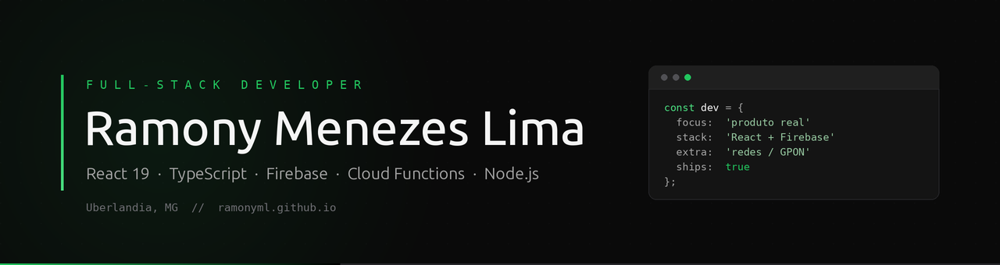

<p align="center">
  <a href="https://ramonyml.github.io"></a>
  <a href="https://www.linkedin.com/in/ramonyml"></a>
  <a href="https://wa.me/5534999886329"></a>
  <a href="mailto:ramonyml@gmail.com"></a>
</p>

---

Desenvolvedor full-stack com produtos rodando em produção de verdade, não só em portfólio. Construí sozinho, do zero, uma plataforma operacional usada todo dia pelo suporte técnico de um provedor de fibra óptica, integrada por API ao ERP da operação, e um SaaS com checkout próprio e assinaturas ativas.

Antes de migrar pra desenvolvimento, passei alguns anos em infraestrutura de redes (GPON/XPON, monitoramento via Zabbix). Isso me dá um domínio técnico pouco comum em projetos que encostam em telecom e provedores. Minha formação em Análise e Desenvolvimento de Sistemas tem ênfase em engenharia de software e documentação técnica: gosto de deixar cada decisão registrada o suficiente pra outra pessoa dar manutenção sem sofrer.

```
Uberlândia, MG   ·   Freelance & vagas CLT/PJ   ·   Presencial, híbrido ou remoto
```

<br />

## Em produção

<table>
<tr>
<td width="50%" valign="top">

### Eterno Dia
**SaaS próprio · com clientes pagantes**

Álbum colaborativo em tempo real para eventos. Os convidados enviam fotos e vídeos por link ou QR Code, sem instalar nada e sem criar conta.

`3 planos` `Stripe + Asaas` `Tempo real`

Checkout com dois gateways, crop de imagem no navegador, download do álbum em ZIP e painel de moderação para o organizador.

<sub>React 19 · Vite · Tailwind CSS 4 · Firebase · Stripe · Asaas</sub>

[**eternodia.com**](https://eternodia.com) <sub>· código proprietário</sub>

</td>
<td width="50%" valign="top">

### Gerador de O.S.
**Plataforma operacional interna · v4.0.1**

Sistema de Ordem de Serviço usado diariamente por toda a equipe de suporte técnico da MZ NET, em produção desde dezembro de 2023.

`37 formulários` `170 variantes` `8 endpoints REST`

Integração completa com o ERP MK Solutions: autenticação, busca de cliente por CPF/CNPJ, abertura de protocolo e criação de O.S. **Atendimento caiu de 10 a 15 minutos para menos de 2.**

<sub>React 19 · TypeScript · Firebase · Cloud Functions · Secret Manager</sub>

<sub>Sistema interno, repositório privado</sub>

</td>
</tr>
<tr>
<td width="50%" valign="top">

### HT Glow Fit
**Cliente real · moda fitness feminina**

Site completo para uma marca 100% online, com catálogo alimentado por Firestore e painel administrativo próprio para a cliente cadastrar produtos e subir fotos sem depender de mim.

`Next.js 16` `Painel admin` `Catálogo dinâmico`

Identidade em preto e branco, pedido por WhatsApp com mensagem pronta por produto, deploy contínuo na Vercel.

<sub>Next.js · React 19 · TypeScript · Tailwind CSS 4 · Firebase</sub>

[**htglowfit.com**](https://htglowfit.com)

</td>
<td width="50%" valign="top">

### Belaroids
**Landing page · fotografia instantânea**

Estética de álbum de memórias artesanal: textura de papel, doodles desenhados à mão, polaroids com rotação aleatória, scroll reveal e parallax de mouse nos elementos decorativos.

`Zero build` `Scroll reveal` `Parallax`

<sub>HTML · Tailwind CSS · JavaScript</sub>

[**belaroids.vercel.app**](https://belaroids.vercel.app/) · [repositório](https://github.com/RamonyML/belaroids)

</td>
</tr>
<tr>
<td width="50%" valign="top">

### Escala de Louvor
**Gestão de ministério de igreja**

Escala pública que sincroniza em tempo real via Firestore: o que o admin edita aparece na hora pra quem está com a página aberta, sem refresh.

`Tempo real` `Export em imagem` `Auth + regras`

Geração automática de cultos por domingo do mês, exportação da escala como imagem em dois formatos e componentes de UI construídos do zero, sem biblioteca pronta.

<sub>React 19 · TypeScript · Vite · Firestore · Firebase Auth · html2canvas</sub>

[**memorial-louvor.web.app**](https://memorial-louvor.web.app) · [repositório](https://github.com/RamonyML/memorial-louvor)

</td>
<td width="50%" valign="top">

### Bolão MZ NET
**Aplicação interna · Copa 2026**

Bolão construído para os funcionários da MZ NET, com ranking em tempo real, pódio animado e pontuação por placar exato ou resultado.

`Zero build` `Anti-fraude` `Painel admin`

Detecção de palpites duplicados e tardios, card compartilhável gerado no navegador e álbum de figurinhas. Feito em JavaScript puro com ES Modules, sem framework.

<sub>JavaScript · Firestore · Firebase Auth · html2canvas</sub>

[repositório](https://github.com/RamonyML/bolao-mznet)

</td>
</tr>
</table>

<br />

## Em desenvolvimento

### OSLine
SaaS white-label para provedores regionais de internet, generalizando os conceitos operacionais do Gerador de O.S. (chamados, escala, chat interno) para atender vários provedores-clientes ao mesmo tempo.

Arquitetura **multi-tenant no Firestore**, com isolamento de dados por tenant em cerca de 24 coleções e permissões por setor e hierarquia.

<sub>React 19 · TypeScript · Firestore Multi-Tenant · Firebase</sub>

<br />

## Produtos à venda

Templates de landing page prontos para publicar, em HTML + Tailwind via CDN, sem etapa de build. Vendidos como arquivo ou com a identidade visual do cliente aplicada por mim.

| Produto | Nicho | Destaque técnico |
| :--- | :--- | :--- |
| **Obscura** | Fotografia | Scroll horizontal pinado, lightbox em tela cheia, cursor customizado |
| **Jogaê** | Comunidade gamer | Glitch RGB, piso holográfico, countdown de torneio, easter egg Konami |
| **Apetite** | Restaurante e delivery | Slider de pratos com arraste, cardápio em abas, pedido por WhatsApp |
| **Vigor** | Academia e personal | Contador de resultados animado, planos com destaque |
| **Belle Studio** | Salão de beleza | Hero animado, catálogo de serviços, galeria e planos |
| **Studio Nova** | Multi-nicho | 4 paletas prontas, FAQ acessível sem JS |
| **Exata Contábil** | Contabilidade | Fundos fotográficos com parallax entre seções |

<sub>Demos ao vivo em [ramonyml.github.io](https://ramonyml.github.io)</sub>

<br />

## Stack

**Front-end**


**Back-end e cloud**


**Integrações**


**Redes e infra**


<br />

## Trajetória

```
2023 — atual   Suporte Técnico N3 · Desenvolvedor Full-Stack
               MZ NET Fibra Óptica, Uberlândia/MG

2021 — 2023    Supervisor de Atendimento e NOC
               TSJ Telemarketing (PRODEPA), Belém/PA

2019 — 2021    Analista de Relacionamento | NOC
               TSJ Telemarketing (PRODEPA), Belém/PA

2019 — 2023    Análise e Desenvolvimento de Sistemas
               Uninter · ênfase em engenharia de software
```

<br />

---

<p align="center">
  <a href="https://ramonyml.github.io"><b>Portfólio completo</b></a>
  &nbsp;·&nbsp;
  <a href="https://wa.me/5534999886329">WhatsApp</a>
  &nbsp;·&nbsp;
  <a href="https://t.me/ramonyml_bot">Telegram</a>
  &nbsp;·&nbsp;
  <a href="https://www.linkedin.com/in/ramonyml">LinkedIn</a>
  &nbsp;·&nbsp;
  <a href="mailto:ramonyml@gmail.com">E-mail</a>
</p>
